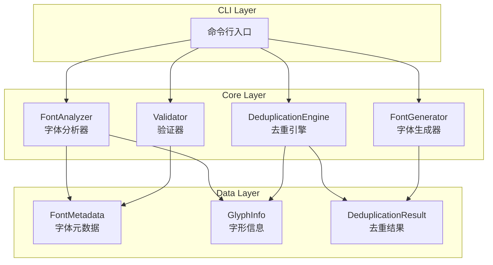
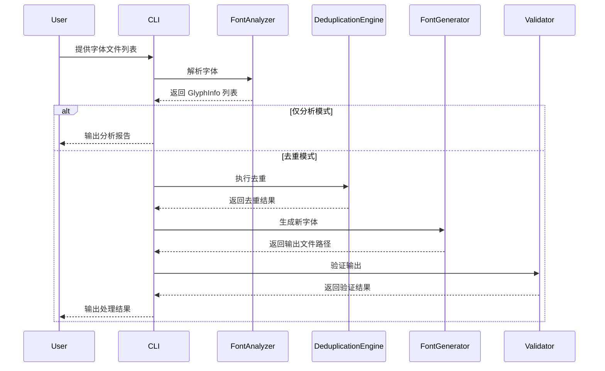

# 设计文档

## 概述

本工具是一个 TTF 字体 glyph 去重系统，通过分析多个字体文件中的 glyph 重复情况，智能地从低优先级字体中移除重复 glyph，从而减小字体资源的总体积。

### 核心设计理念

1. **非破坏性处理**: 原始字体文件保持不变，生成新的优化文件
2. **优先级驱动**: 用户可控制哪个字体保留完整 glyph
3. **模块化架构**: 分析、去重、生成三个独立模块
4. **可扩展性**: 支持未来添加更多字体格式

### 技术栈选择

- **语言**: Python 3.10+
- **字体处理库**: fonttools（业界标准的字体操作库）
- **CLI 框架**: click（简洁的命令行接口）
- **测试框架**: pytest + hypothesis（property-based testing）

### 字形相似度算法设计决策

**当前实现：严格相等性检查**

系统采用二元相等性检查（完全相同 = 1.0，不同 = 0.0）而非渐进式相似度评分。这一设计基于以下考虑：

1. **矢量数据的精确性**: TTF 轮廓数据是精确的矢量路径，不包含渲染时的抗锯齿或 hinting 差异
2. **零误判保证**: 任何轮廓数据的差异都代表真实的设计差异，严格检查避免错误地删除实际不同的字形
3. **性能优势**: 字节级比较比复杂的形状分析算法快得多，适合处理大型字体集
4. **明确的语义**: 开发者可以清楚地知道"重复"意味着完全相同，"变体"意味着有任何差异

**未来扩展方向**:
- 如需更细粒度的相似度评估，可以扩展为基于轮廓点距离、形状特征或视觉感知的算法
- 可以添加可配置的相似度算法选项，让用户根据需求选择严格模式或宽松模式

## 架构



### 处理流程



## 组件与接口

### 1. FontAnalyzer（字体分析器）

负责解析 TTF 文件并提取 glyph 信息。

```python
class FontAnalyzer:
    def parse_font(self, font_path: Path) -> FontMetadata:
        """解析单个字体文件，返回元数据"""
        pass
    
    def extract_glyphs(self, font_path: Path) -> list[GlyphInfo]:
        """提取字体中所有 glyph 的信息"""
        pass
    
    def find_duplicates(self, fonts: list[Path]) -> DuplicateReport:
        """分析多个字体，找出重复的 glyph"""
        pass

### 1.1. ShapeAnalyzer（字形分析器）

负责提取和比较 glyph 的形状数据。

```python
class ShapeAnalyzer:
    def extract_glyph_outline(self, font_path: Path, codepoint: int) -> GlyphOutline:
        """提取指定字符的轮廓数据"""
        pass
    
    def calculate_similarity(self, outline1: GlyphOutline, outline2: GlyphOutline) -> float:
        """
        计算两个字形的相似度（0.0-1.0）
        
        采用严格的相等性检查：只有轮廓数据完全相同才返回 1.0，
        否则返回 0.0。这是因为 TTF 文件中的轮廓数据是矢量数据，
        不包含抗锯齿或 hinting 等渲染时的差异。任何轮廓数据的
        不同都意味着字形设计上的真实差异。
        """
        pass
    
    def find_shape_variants(
        self, 
        fonts: list[Path], 
        similarity_threshold: float = 1.0,
        codepoint_limit: int | None = None
    ) -> ShapeVariantReport:
        """
        找出字形变体（相同码点但形状不同的字符）
        
        注意：此方法可能需要较长时间，因为需要提取和比较每个字符的轮廓数据。
        对于包含数千字符的字体，建议使用 codepoint_limit 参数限制分析范围。
        
        Args:
            fonts: 要分析的字体文件路径列表
            similarity_threshold: 相似度阈值（当前实现使用严格相等，此参数保留用于兼容性）
            codepoint_limit: 可选的 codepoint 分析数量限制
        """
        pass
```

### 2. DeduplicationEngine（去重引擎）

根据优先级策略执行 glyph 去重，支持基于字形相似度的智能去重。

```python
class DeduplicationEngine:
    def __init__(
        self, 
        priority: list[Path] | None = None,
        shape_analysis_enabled: bool = False,
        similarity_threshold: float = 1.0
    ):
        """初始化，可选指定字体优先级和字形分析参数"""
        pass
    
    def deduplicate(
        self,
        fonts: list[Path],
        unicode_ranges: list[tuple[int, int]] | None = None,
        exclude_ranges: list[tuple[int, int]] | None = None
    ) -> DeduplicationResult:
        """执行去重，返回每个字体应保留的 glyph"""
        pass
    
    def deduplicate_with_shape_analysis(
        self,
        fonts: list[Path],
        unicode_ranges: list[tuple[int, int]] | None = None,
        exclude_ranges: list[tuple[int, int]] | None = None
    ) -> ShapeAwareDeduplicationResult:
        """执行基于字形分析的智能去重"""
        pass
```

### 3. FontGenerator（字体生成器）

根据去重结果生成新的 TTF 文件。

```python
class FontGenerator:
    def generate(
        self,
        source_font: Path,
        glyphs_to_keep: set[int],
        output_path: Path
    ) -> Path:
        """生成仅包含指定 glyph 的新字体"""
        pass
    
    def batch_generate(
        self,
        dedup_result: DeduplicationResult,
        output_dir: Path,
        suffix: str = "_dedup"
    ) -> list[Path]:
        """批量生成去重后的字体文件"""
        pass
```

### 4. Validator（验证器）

验证生成的字体文件的有效性。

```python
class Validator:
    def validate_ttf(self, font_path: Path) -> ValidationResult:
        """验证 TTF 文件格式是否有效"""
        pass
    
    def validate_glyphs(
        self,
        font_path: Path,
        expected_codepoints: set[int]
    ) -> ValidationResult:
        """验证指定的 Unicode code point 是否可访问"""
        pass
```

### 5. Reporter（报告系统）

提供中文输出报告和错误信息，技术关键词保留英文。

```python
class Reporter:
    """输出报告生成器，最终报告和错误信息使用中文"""
    
    def __init__(self):
        """初始化 reporter"""
        pass
    
    def generate_analysis_report(self, duplicate_report: DuplicateReport) -> str:
        """生成分析报告（中文）"""
        pass
    
    def generate_deduplication_report(self, result: DeduplicationResult) -> str:
        """生成去重结果报告（中文）"""
        pass
    
    def format_error(self, error: Exception) -> str:
        """格式化错误信息（中文）"""
        pass
    
    def format_validation_result(self, result: ValidationResult) -> str:
        """格式化验证结果（中文）"""
        pass
```

**输出规范：**

- 最终报告和错误信息使用中文
- 技术关键词保留英文：TTF、glyph、cmap、Unicode、code point 等
- CLI 命令和参数保留英文：`--analyze`、`--output-dir` 等
- 文件路径保留原样
- 测试代码和测试流程使用英文
- 代码注释使用中文
- 示例报告：`"分析完成：共发现 1234 个重复 glyph，涉及 3 个字体文件"`

## 数据模型

```python
from dataclasses import dataclass
from pathlib import Path

@dataclass
class GlyphInfo:
    """单个 glyph 的信息"""
    codepoint: int          # Unicode code point
    glyph_name: str         # glyph 名称
    glyph_index: int        # 在字体中的索引
    
@dataclass
class GlyphOutline:
    """字形轮廓数据"""
    codepoint: int
    font_path: Path
    outline_data: bytes     # 轮廓的二进制数据
    bounding_box: tuple[float, float, float, float]  # (xMin, yMin, xMax, yMax)
    
@dataclass
class ShapeVariant:
    """字形变体信息"""
    codepoint: int
    fonts: list[Path]       # 包含此变体的字体列表
    similarity_scores: dict[tuple[Path, Path], float]  # 字体对之间的相似度
    
@dataclass
class FontMetadata:
    """字体元数据"""
    path: Path
    family_name: str
    glyph_count: int
    codepoints: set[int]    # 支持的所有 Unicode code point
    
@dataclass
class DuplicateReport:
    """重复分析报告"""
    fonts: list[FontMetadata]
    duplicates: dict[int, list[Path]]  # code point -> 包含该 glyph 的字体列表
    total_duplicate_count: int
    
@dataclass
class ShapeVariantReport:
    """字形变体分析报告"""
    fonts: list[FontMetadata]
    shape_variants: list[ShapeVariant]  # 检测到的字形变体
    unicode_duplicates: dict[int, list[Path]]  # 纯 Unicode 重复（高相似度）
    total_variant_count: int
    
@dataclass
class DeduplicationResult:
    """去重结果"""
    font_glyphs: dict[Path, set[int]]  # 每个字体应保留的 code point
    removed_glyphs: dict[Path, set[int]]  # 每个字体被移除的 code point
    
@dataclass
class ShapeAwareDeduplicationResult:
    """基于字形分析的去重结果"""
    font_glyphs: dict[Path, set[int]]  # 每个字体应保留的 code point
    removed_glyphs: dict[Path, set[int]]  # 每个字体被移除的 code point
    preserved_variants: list[ShapeVariant]  # 被保护的字形变体
    similarity_data: dict[int, dict[tuple[Path, Path], float]]  # 相似度数据
    
@dataclass
class ValidationResult:
    """验证结果"""
    is_valid: bool
    errors: list[str]
    warnings: list[str]
```


## 正确性属性

*属性是系统在所有有效执行中应保持为真的特征或行为——本质上是关于系统应该做什么的形式化陈述。属性作为人类可读规范和机器可验证正确性保证之间的桥梁。*

### Property 1: 解析完整性

*对于任意*有效的 TTF 文件集合，解析后返回的 GlyphInfo 列表应包含该字体中所有 glyph 的 Unicode 映射信息，且映射数量与原字体的 cmap table 条目数一致。

**Validates: Requirements 1.1**

### Property 2: 重复检测准确性

*对于任意*字体集合，分析报告中标记为重复的 code point 集合应等于所有字体 code point 集合的交集。

**Validates: Requirements 1.2, 1.3**

### Property 3: 优先级保留不变量

*对于任意*字体优先级顺序和字体集合，去重后高优先级字体中的所有原始 glyph 应被完整保留，不会被移除。

**Validates: Requirements 2.1, 2.3**

### Property 4: 默认优先级一致性

*对于任意*字体列表，当未指定优先级时，去重结果应与使用输入顺序作为优先级时的结果完全一致。

**Validates: Requirements 2.2**

### Property 5: Glyph 保留完整性

*对于任意*去重结果，输出字体中应包含所有被标记为保留的 glyph，且不包含任何被标记为移除的 glyph。

**Validates: Requirements 3.1, 3.2**

### Property 6: cmap 一致性

*对于任意*生成的字体文件，其 cmap table 中的 code point 集合应与该字体保留的 glyph code point 集合完全一致。

**Validates: Requirements 3.3**

### Property 7: Unicode 范围过滤

*对于任意*指定的 Unicode 范围，去重操作只应影响范围内的 glyph，范围外的 glyph 应保持不变（即使重复）。

**Validates: Requirements 4.1, 4.2**

### Property 8: 排除范围保护

*对于任意*指定的排除范围，该范围内的 glyph 在所有字体中都应被保留，无论是否与其他字体重复。

**Validates: Requirements 4.3**

### Property 9: 输出字体有效性

*对于任意*生成的输出字体，该文件应是有效的 TTF 格式，可被标准字体解析库正确读取。

**Validates: Requirements 6.1**

### Property 10: Glyph 可访问性

*对于任意*输出字体和其保留的 code point 集合，每个 code point 都应能通过 cmap table 正确映射到对应的 glyph。

**Validates: Requirements 6.2**

### Property 11: 输出报告语言规范

*对于任意*最终输出报告或错误信息，消息主体应使用中文，而技术关键词（TTF、glyph、cmap、Unicode、code point 等）和 CLI 命令应保留英文原文。

**Validates: Requirements 7.1, 7.4**

### Property 12: 字形轮廓提取完整性

*对于任意*有效的字体文件和其包含的 Unicode 码点，字形分析器提取的轮廓数据应包含完整的路径信息且边界框坐标有效。

**Validates: Requirements 8.1**

### Property 13: 字形相似度计算有效性

*对于任意*两个字形轮廓，相似度计算结果应在 0.0 到 1.0 范围内，且完全相同的字形相似度应等于 1.0。

**设计决策：** 当前实现采用严格的二元相等性检查（1.0 表示完全相同，0.0 表示不同），而非渐进式相似度评分。这是因为 TTF 轮廓数据是精确的矢量数据，任何差异都代表真实的设计差异。未来如需更细粒度的相似度评估，可以扩展为基于轮廓点距离或形状特征的算法。

**Validates: Requirements 8.2**

### Property 14: 字形变体识别准确性

*对于任意*字形相似度阈值和字形对，当相似度低于阈值时应被标记为字形变体，高于或等于阈值时应被标记为重复。

**设计决策：** 在当前的严格相等实现中，默认阈值为 1.0（完全相同）。相似度为 1.0 的字形对被标记为 Unicode 重复，相似度为 0.0 的字形对被标记为字形变体。这种方法确保了零误判，且性能最优，因为严格相等检查比复杂的相似度计算更快。

**Validates: Requirements 8.3**

### Property 15: 字形检测模式一致性

*对于任意*字体集合，启用字形检测模式时的去重决策应基于字形相似度，而非启用时应仅基于 Unicode 码点匹配。

**Validates: Requirements 8.4**

### Property 16: 报告分类显示准确性

*对于任意*包含字形变体的分析结果，报告应正确区分并分别显示"Unicode 重复"和"字形变体"两种类型。

**Validates: Requirements 8.5**

## 性能考虑

### 字形分析性能优化

字形变体检测涉及提取和比较大量字形轮廓数据，可能成为性能瓶颈。系统采用以下优化策略：

1. **批量字体打开**: 一次性打开所有字体文件并保持打开状态，避免重复的文件 I/O 操作
2. **共享码点过滤**: 仅分析在多个字体中都存在的码点，跳过只在单个字体中出现的字符
3. **可选的码点限制**: 提供 `codepoint_limit` 参数，允许用户限制分析范围以加快处理速度
4. **延迟计算**: 仅在启用字形检测模式时才执行轮廓提取和比较

**性能预期**:
- 默认阈值 1.0 使用严格相等检查，性能最优
- 对于包含数千字符的 CJK 字体，完整的字形分析可能需要数分钟
- 建议在初次分析时使用 `codepoint_limit` 参数进行快速评估
- 对于生产环境，可以将分析结果缓存以避免重复计算

## 错误处理

### 输入验证错误

| 错误类型 | 触发条件 | 处理方式 |
|---------|---------|---------|
| FileNotFoundError | 字体文件路径不存在 | 抛出异常，提示文件路径 |
| InvalidFontError | 文件不是有效的 TTF 格式 | 抛出异常，提示文件格式问题 |
| EmptyFontListError | 未提供任何字体文件 | 抛出异常，提示至少需要一个字体 |

### 处理过程错误

| 错误类型 | 触发条件 | 处理方式 |
|---------|---------|---------|
| InvalidUnicodeRangeError | Unicode 范围格式错误 | 抛出异常，提示正确格式 |
| OutputDirectoryError | 输出目录不可写 | 抛出异常，提示权限问题 |
| FontGenerationError | 字体生成失败 | 抛出异常，包含详细错误信息 |

### 验证错误

| 错误类型 | 触发条件 | 处理方式 |
|---------|---------|---------|
| ValidationError | 输出字体验证失败 | 返回 ValidationResult，包含错误详情 |

### 字形分析错误

| 错误类型 | 触发条件 | 处理方式 |
|---------|---------|---------|
| InvalidSimilarityThresholdError | 相似度阈值不在 0.0-1.0 范围内 | 抛出异常，提示有效范围 |
| GlyphExtractionError | 无法提取特定字形的轮廓数据 | 记录警告，跳过该字形继续处理 |
| EmptyFontListError | 字形分析时未提供字体文件 | 抛出异常，提示至少需要一个字体 |

## 测试策略

### 单元测试

使用 pytest 进行单元测试，覆盖以下场景：

1. **FontAnalyzer 测试**
   - 解析有效 TTF 文件
   - 处理无效文件格式
   - 提取 glyph 信息的准确性

2. **ShapeAnalyzer 测试**
   - 字形轮廓数据提取
   - 字形相似度计算准确性
   - 字形变体识别逻辑

3. **DeduplicationEngine 测试**
   - 优先级排序逻辑
   - Unicode 范围过滤
   - 排除范围处理
   - 字形检测模式切换
   - 基于相似度的去重决策

4. **FontGenerator 测试**
   - 生成有效 TTF 文件
   - 命名规则应用
   - Metadata 保留

5. **Validator 测试**
   - TTF 格式验证
   - Glyph 可访问性检查

6. **Reporter 测试**
   - 最终报告中文输出
   - 错误信息中文输出
   - 技术关键词英文保留
   - 字形变体与 Unicode 重复的区分显示
   - 测试代码使用英文

### Property-Based Testing

使用 hypothesis 库进行 property-based testing，验证正确性属性：

- 每个 property test 运行至少 100 次迭代
- 使用 hypothesis 的 `@given` 装饰器生成随机测试数据
- 每个 property test 必须标注对应的正确性属性编号
- 测试代码、测试函数名、断言信息使用英文
- 测试中的代码注释使用中文

**测试数据生成策略：**

```python
from hypothesis import strategies as st

# Generate random Unicode code point sets
codepoint_set = st.frozensets(st.integers(min_value=0x20, max_value=0xFFFF))

# Generate random font data (mocked)
font_data = st.fixed_dictionaries({
    'name': st.text(min_size=1, max_size=20),
    'codepoints': codepoint_set
})

# Generate random Unicode ranges
unicode_range = st.tuples(
    st.integers(min_value=0x20, max_value=0x7FFF),
    st.integers(min_value=0x8000, max_value=0xFFFF)
)
```

### 集成测试

使用实际的 TTF 文件进行端到端测试：

1. 使用工作区中的 Noto Sans 作为测试数据
2. 验证完整的去重流程
3. 验证 CLI 命令的正确性

